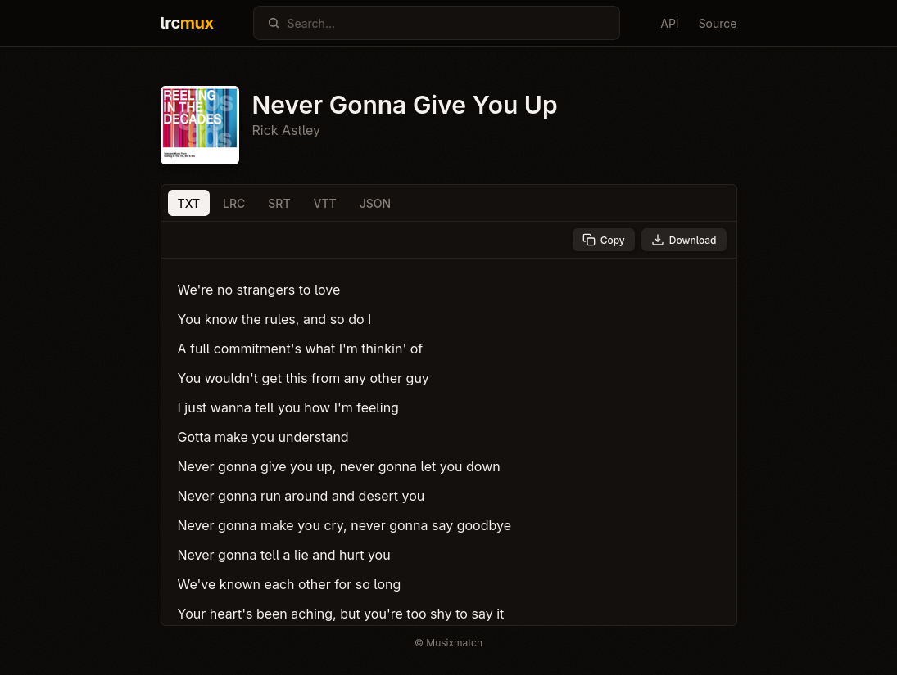

# lrcmux

<div align="center">
  <a href="https://lrcmux.dev/s/Rick-Astley/Never-Gonna-Give-You-Up">
    
  </a>
</div>

A lyrics aggregator API. Fans out requests across multiple providers, picks the best result, and caches everything.

A public instance runs at **[lrcmux.dev](https://lrcmux.dev)**. The API docs are browsable at [lrcmux.dev/docs](https://lrcmux.dev/docs).

## Self-hosting

### Docker Compose

The easiest way to run the full stack (API + frontend + Redis):

```sh
git clone https://github.com/f1nniboy/lrcmux
cd lrcmux
cp config.example.toml config.toml
docker compose up
```

The API will be available at `http://localhost:8080` and the frontend at `http://localhost:3000`.

### Binary

```sh
git clone https://github.com/f1nniboy/lrcmux
cd lrcmux
cp config.example.toml config.toml
go run ./cmd/lrcmux -config config.toml
```

### Fly.io + Cloudflare Workers

The API runs on Fly.io and the frontend on Cloudflare Workers. Set up the API first:

```sh
fly launch --no-deploy
fly secrets set REDIS_URL=redis://...
```

Then deploy both:

```sh
just deploy
```

## Configuration

See `config.example.toml` for all available options.

## I have a question!

Join the Matrix room at **[#lrcmux:oss.zone](https://matrix.to/#/#lrcmux:oss.zone)**.
